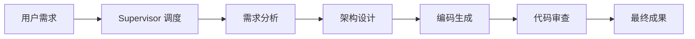
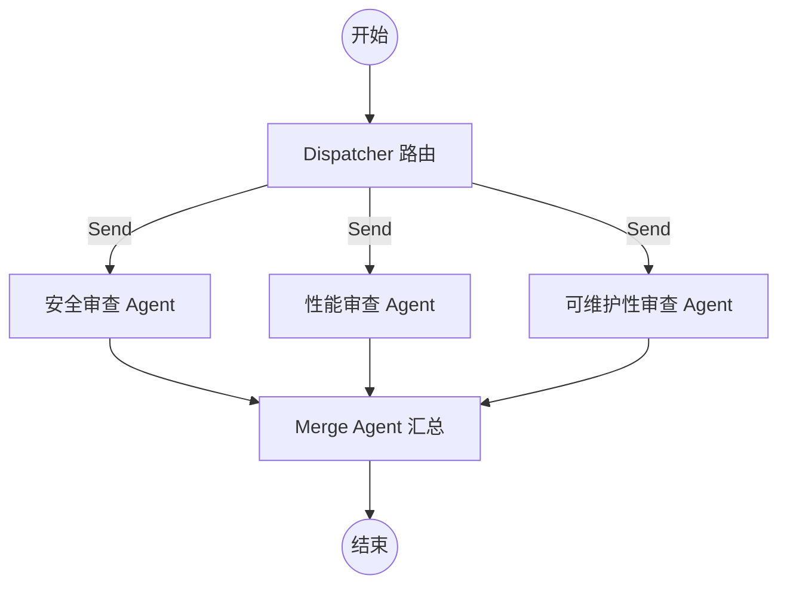
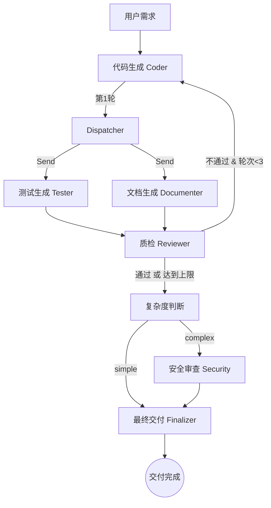

# 🤖 Multi-Agent Demo

> 基于 **LangGraph + Groq** 的多 Agent 编排演示平台，支持多种编排模式，Streamlit 亮色 UI 实时展示执行过程。

## 功能特性

- **Supervisor Pipeline**（顺序流转）：Supervisor 统一调度，四个子 Agent 顺序流转，每个 Agent 的输出作为下一个的输入上下文
- **Conditional Branch**（动态路由）：根据输入类型（新功能/代码审查/技术方案），动态激活对应的一组 Agent
- **Loop Feedback**（迭代优化）：编码 Agent 生成代码后，质检 Agent 进行评审，不合格则打回重做（最多重试3次）
- **Parallel Review**（并行审查）：用户输入代码，3个 Agent（安全/性能/可维护性）并行审查，最后由 Merge Agent 整合成统一报告
- **Debate Mode**（对抗辩论）：支持方与反对方针对代码设计进行多轮博弈，最后由裁判 Agent 给出终极裁决
- **Nested Agent**（任务拆解）：主 Agent 根据需求动态规划，按需召唤子 Agent 完成代码、测试或文档，实现树状任务分发
- **Hybrid A**（三阶段混合流水线）：并行生成（代码 + 测试 + 文档）→ 循环质检（最多3轮）→ 条件分支（复杂代码进行安全审查），复用已有模式的 Agent，组合为全自动交付链路
- **模型自动降级**：依次尝试 6 个模型，成功即返回并在 UI 中标注实际使用的模型名
- **多模式切换**：侧边栏一键切换编排模式，界面实时动态刷新
- **实时状态展示**：执行中动态更新 Agent 状态徽章，折叠面板展示各 Agent 输出

## 架构

### 1. Supervisor Pipeline (顺序编排)



### 2. Parallel Review (并行编排)

利用 LangGraph 的 `Send` API 实现动态并行分发，最后由聚合节点进行汇总。



### 3. Hybrid A (三阶段混合流水线)

复用已有模式的 Agent，将并行、循环、条件分支三种编排模式组合为一条全自动交付链路。



## 技术栈

| 组件 | 技术 |
|------|------|
| Agent 编排 | LangGraph (StateGraph) |
| 推理模型 | Groq（自动降级，支持 6 个模型） |
| 界面 | Streamlit（亮色主题） |
| Prompt 管理 | 模块化 Python 模板 |

## 模型降级列表

按优先级从高到低依次尝试，失败自动切换到下一个：

```
openai/gpt-oss-120b
→ openai/gpt-oss-20b
→ qwen/qwen3-32b
→ meta-llama/llama-4-scout-17b-16e-instruct
→ llama-3.3-70b-versatile
→ llama-3.1-8b-instant
```

每个 Agent 的输出面板旁会显示实际命中的模型名。

## 核心实现细节

### 1. 统一 UI 与 降级渲染 (`app.py`)
- **模型徽章**：UI 实时展示每个步骤最终命中的 LLM 模型（例如 `🧠 llama-3.3-70b-versatile`），增强编排透明度。
- **状态流转**：使用 `st.session_state` 配合 `st.empty()` 占位符，实现 Agent 从 `pending` -> `running` -> `done` 的动态动画反馈。
- **模式解耦**：每个编排模式通过独立的 `_render_xxx` 函数实现，逻辑与 UI 分离。

### 2. 并行编排机制 (`parallel/`)
- **动态分发**：使用 `Send` API 在路由阶段动态创建任务，支持真正的并发执行。
- **状态合并 (Reducer)**：针对并行更新冲突（如 `model_used_by` 字典），在 `StateGraph` 中定义了 `Annotated` 与 `merge_dicts` 聚合函数，确保多路并发结果能安全合并。
- **多维度审查**：预设了安全、性能、可维护性三个专业维度，通过专门的 System Prompts 驱动。

## 项目结构

```
multi-agent/
├── app.py                    # 统一 Streamlit 入口（模式切换 + UI）
├── config.py                 # 共享配置（模型列表、Agent 元信息）
├── llm.py                    # call_with_fallback()：模型降级调用层
├── supervisor_pipeline/      # ✅ Supervisor 顺序流转模式
│   ├── __init__.py
│   ├── graph.py              # LangGraph StateGraph 图定义
│   ├── agents/
│   │   ├── analyst.py        # 需求分析 Agent
│   │   ├── architect.py      # 架构设计 Agent
│   │   ├── coder.py          # 编码 Agent
│   │   └── reviewer.py       # 代码审查 Agent
│   └── prompts/
│       ├── analyst_prompt.py
│       ├── architect_prompt.py
│       ├── coder_prompt.py
│       └── reviewer_prompt.py
├── conditional_branch/       # ✅ 条件动态路由模式
│   ├── __init__.py
│   ├── graph.py              # 路由分支图定义
│   ├── agents/               # router, cb_analyst, cb_coder 等
│   └── prompts/              # all_prompts.py
├── loop_feedback/            # ✅ 循环反馈收敛模式
│   ├── __init__.py
│   ├── graph.py              # 含条件反馈循环的图定义
│   ├── agents/               # coder, reviewer
│   └── prompts.py
├── parallel/                 # ✅ Parallel 并行审查模式
│   ├── __init__.py
│   ├── graph.py              # 使用 Send API 实现 fan-out → fan-in
│   ├── agents/
│   │   ├── security.py       # 安全审查 Agent
│   │   ├── performance.py   # 性能审查 Agent
│   │   ├── maintainability.py # 可维护性审查 Agent
│   │   └── merger.py       # 合并 Agent
│   └── prompts.py           # 所有 Prompt 模板
├── debate/                   # ✅ Debate 对抗辩论模式
│   ├── __init__.py
│   ├── graph.py              # 实现多轮次对抗逻辑
│   ├── agents/               # pro, con, judge
│   └── prompts.py
├── nested_agent/             # ✅ Nested Agent 嵌套拆解模式
│   ├── __init__.py
│   ├── graph.py              # 动态路由与子任务调度
│   ├── agents/               # orchestrator, coder, tester 等
│   └── prompts.py
├── hybrid_a/                 # ✅ Hybrid A 三阶段混合流水线
│   ├── __init__.py
│   ├── graph.py              # 并行→循环→条件分支 三阶段图定义
│   ├── agents/
│   │   ├── complexity.py     # 复杂度判断 Agent（新）
│   │   └── finalizer.py      # 最终交付整合 Agent（新）
│   └── prompts.py            # complexity + finalizer Prompt 模板
├── requirements.txt
├── .env.example
└── .env                      # 本地密钥（不提交）
```

## 快速开始

### 1. 创建并激活虚拟环境（推荐）

```bash
# Windows (PowerShell)
python -m venv .venv
.venv\Scripts\Activate.ps1

# macOS / Linux
python -m venv .venv
source .venv/bin/activate
```

### 2. 安装依赖

```bash
pip install -r requirements.txt
```

### 2. 配置环境变量

```bash
cp .env.example .env
# 编辑 .env，填入你的 GROQ_API_KEY
```

`.env` 示例：

```
GROQ_API_KEY=your_groq_api_key_here
LLM_TEMPERATURE=0.3
LLM_MAX_TOKENS=4096
```

### 3. 启动应用

```bash
streamlit run app.py
```

浏览器访问 `http://localhost:8501`

## 使用方式

1. 侧边栏选择编排模式（目前 **Supervisor Pipeline**, **Conditional Branch**, **Loop Feedback**, **Parallel Review**, **Debate**, **Nested Agent**, **Hybrid A** 均可用）
2. 在主区域输入框中描述软件需求或粘贴代码
3. 点击「🚀 开始执行」
4. 折叠面板展示每个 Agent 的执行结果，顶部显示实际命中的模型名

## 编排模式路线图

| 模式 | 说明 | 状态 |
|------|------|------|
| Supervisor Pipeline | 四个 Agent 顺序流转 | ✅ 已上线 |
| Conditional Branch | 条件动态路由 | ✅ 已上线 |
| Loop Feedback | 迭代反馈收敛 | ✅ 已上线 |
| Parallel | 多 Agent 并行汇总 | ✅ 已上线 |
| Debate | 多 Agent 对抗辩论 | ✅ 已上线 |
| Nested Agent | 嵌套子 Agent 调用 | ✅ 已上线 |
| Hybrid A | 并行 + 循环质检 + 条件分支混合流水线 | ✅ 已上线 |

## License

MIT
