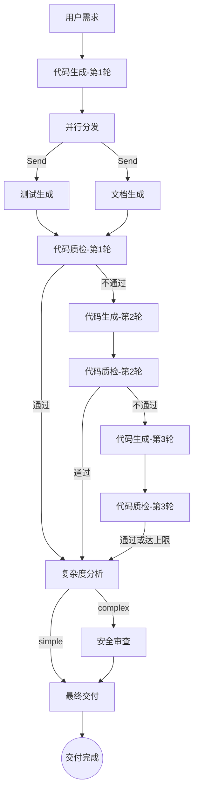
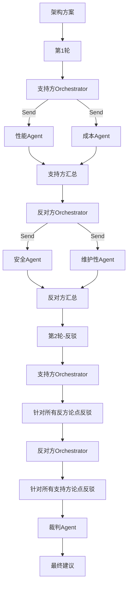

# Multi-Agent AI Tools

> 基于 **LangGraph + Groq + Streamlit** 的多智能体协作平台，支持8种编排模式，现代化紫色主题UI，实时展示执行过程。

## ✨ 功能特性

### 🎨 全新UI设计
- **现代化紫色主题**：深色顶部导航栏 + 紫色渐变按钮 + 浅灰白背景
- **卡片式侧边栏**：每个模式独立卡片，带图标、描述、状态标签
- **实时状态展示**：执行中动态更新，折叠面板展示各Agent输出
- **模型信息徽章**：每个Agent旁显示实际使用的模型（🧠 llama-3.3-70b-versatile）
- **多语言支持**：中文/日语/英语三语切换

### 🤖 8种编排模式

1. **顺序流水线**：Supervisor统一调度，四个子Agent顺序流转
2. **条件分支**：根据输入类型动态激活对应Agent组
3. **循环反馈**：编码→质检→重做循环（最多3轮）
4. **并行执行**：3个Agent并行审查，最后整合报告
5. **辩论模式**：支持方vs反对方多轮博弈，裁判终极裁决
6. **嵌套Agent**：主Agent动态规划，按需召唤子Agent
7. **混合模式A**：并行生成→循环质检→条件分支，全自动交付链路
8. **混合模式B**：辩论+嵌套混合，基于子Agent数据辩论

### 🔧 核心能力
- **模型自动降级**：依次尝试6个模型，失败自动切换
- **智能规划**：嵌套Agent支持关键词识别（"只要代码"→跳过测试文档）
- **实时渲染**：执行过程中逐步显示结果，不会"卡住"
- **复杂度判断**：自动识别数据库/网络/加密操作，触发安全审查

## 🏗️ 架构

### 混合模式A（三阶段流水线）



**特点**：
- 第1轮：代码生成 → 并行生成测试+文档 → 代码质检
- 第2-3轮：代码生成 → 代码质检（跳过并行）
- 复杂度判断：识别数据库/网络/加密等关键词 → 触发安全审查
- 最终交付：整合所有结果 + 质检状态 + 复杂度 + 安全报告

### 混合模式B（辩论+嵌套）



**特点**：
- 每方先召唤专项子Agent收集数据
- UI实时显示子Agent状态（⚡性能✅ 💰成本✅）
- 第2轮自动获取对方所有历史论点进行针对性反驳

## 🛠️ 技术栈

| 组件 | 技术 |
|------|------|
| Agent编排 | LangGraph (StateGraph) |
| 推理模型 | Groq（6模型自动降级） |
| 界面 | Streamlit（紫色主题） |
| Prompt管理 | 模块化Python模板 |

## 📦 模型降级列表

按优先级从高到低依次尝试：

```
openai/gpt-oss-120b
→ openai/gpt-oss-20b
→ qwen/qwen3-32b
→ meta-llama/llama-4-scout-17b-16e-instruct
→ llama-3.3-70b-versatile
→ llama-3.1-8b-instant
```

## 📁 项目结构

```
multi-agent/
├── app.py                    # Streamlit入口（模式切换+UI）
├── config.py                 # 共享配置
├── llm.py                    # 模型降级调用层
├── supervisor_pipeline/      # 顺序流水线
├── conditional_branch/       # 条件分支
├── loop_feedback/            # 循环反馈
├── parallel/                 # 并行执行
├── debate/                   # 辩论模式
├── nested_agent/             # 嵌套Agent
├── hybrid_a/                 # 混合模式A
│   ├── agents/
│   │   ├── complexity.py     # 复杂度判断
│   │   └── finalizer.py      # 最终交付
│   └── prompts.py
├── hybrid_b/                 # 混合模式B
│   ├── agents/
│   │   ├── pro_orchestrator.py
│   │   ├── con_orchestrator.py
│   │   ├── performance.py
│   │   ├── cost.py
│   │   ├── security.py
│   │   ├── maintainability.py
│   │   ├── pro_summarizer.py
│   │   ├── con_summarizer.py
│   │   └── judge.py
│   └── prompts.py
├── requirements.txt
└── .env.example
```

## 🚀 快速开始

### 1. 创建虚拟环境

```bash
# Windows
python -m venv .venv
.venv\Scripts\Activate.ps1

# macOS/Linux
python -m venv .venv
source .venv/bin/activate
```

### 2. 安装依赖

```bash
pip install -r requirements.txt
```

### 3. 配置环境变量

```bash
cp .env.example .env
# 编辑.env，填入GROQ_API_KEY
```

`.env`示例：

```
GROQ_API_KEY=your_groq_api_key_here
LLM_TEMPERATURE=0.3
LLM_MAX_TOKENS=4096
```

### 4. 启动应用

```bash
streamlit run app.py
```

浏览器访问 `http://localhost:8501`

## 📖 使用方式

1. **选择模式**：侧边栏点击卡片切换编排模式
2. **输入需求**：主区域输入框描述需求或粘贴代码
3. **开始执行**：点击紫色渐变按钮「🚀 开始执行」
4. **查看结果**：折叠面板展示各Agent输出，顶部显示模型名

### 嵌套Agent特殊用法

支持关键词识别：
- "只要代码" / "只需要代码" / "仅代码" → 跳过测试和文档
- "不需要测试" → 跳过测试
- "不需要文档" → 跳过文档

### 混合模式A复杂度判断

自动识别关键词触发安全审查：
- 数据库：database, db, sql, query, connect, session
- 认证：password, hash, token, jwt, auth, login, encrypt
- 网络：http, request, api, socket, client
- 代码超过50行

## 🗺️ 编排模式路线图

| 模式 | 说明 | 状态 |
|------|------|------|
| 🔄 顺序流水线 | 四个Agent顺序流转 | ✅ 已上线 |
| 🔀 条件分支 | 条件动态路由 | ✅ 已上线 |
| 🔁 循环反馈 | 迭代反馈收敛 | ✅ 已上线 |
| 🔱 并行执行 | 多Agent并行汇总 | ✅ 已上线 |
| ⚔️ 辩论模式 | 多Agent对抗辩论 | ✅ 已上线 |
| 🪆 嵌套Agent | 嵌套子Agent调用 | ✅ 已上线 |
| 🎛️ 混合模式A | 并行+循环+条件分支 | ✅ 已上线 |
| 🎭 混合模式B | 辩论+嵌套混合 | ✅ 已上线 |

## 🎨 UI特性

- **紫色主题**：#6C63FF主色调，现代化设计
- **卡片布局**：每个模式独立卡片，悬停动画
- **实时反馈**：执行过程中逐步显示结果
- **模型徽章**：每个Agent显示使用的模型
- **多语言**：中文/日语/英语切换
- **响应式**：自适应不同屏幕尺寸

## 📝 License

MIT
