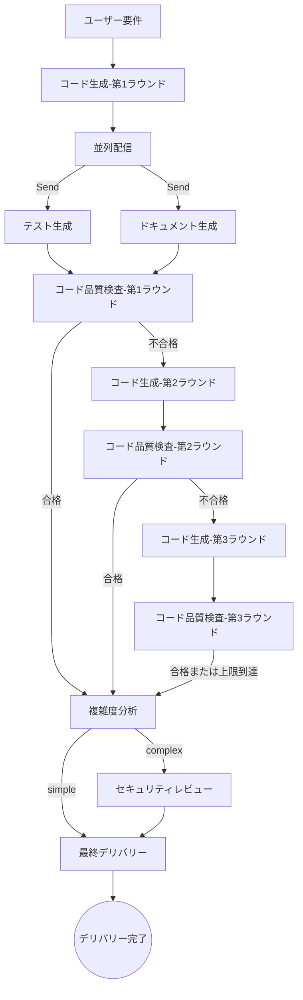
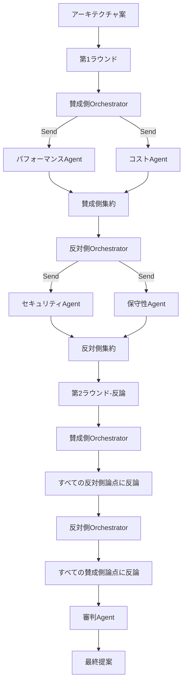

# Multi-Agent AI Tools

> **LangGraph + Groq + Streamlit** で構築されたマルチエージェント協調プラットフォーム。8種類のオーケストレーションパターン、モダンなパープルテーマUI、リアルタイム実行状況の可視化に対応。

## ✨ 主な機能

### 🎨 新しいUIデザイン
- **モダンなパープルテーマ**：ダークナビゲーションバー + パープルグラデーションボタン + ライトグレー背景
- **カード型サイドバー**：各モードを独立したカードで表示、アイコン・説明・ステータスラベル付き
- **リアルタイムステータス表示**：実行中の動的更新、折りたたみパネルで各エージェントの出力を表示
- **モデル情報バッジ**：各エージェントが使用中のモデルを表示（🧠 llama-3.3-70b-versatile）
- **多言語対応**：日本語/中国語/英語の切り替えに対応

### 🤖 8種類のオーケストレーションパターン

1. **シーケンシャルパイプライン**：Supervisorが統括し、4つのサブエージェントが順次処理
2. **条件分岐**：入力タイプに応じて適切なエージェントグループを動的に起動
3. **ループフィードバック**：コーディング→品質チェック→修正のループ（最大3回）
4. **並列実行**：3つのエージェントが並列でレビュー、最後に統合レポートを生成
5. **ディベートモード**：賛成派vs反対派の多ラウンド討論、審判が最終判定
6. **ネストエージェント**：メインエージェントが動的に計画し、必要に応じてサブエージェントを呼び出し
7. **ハイブリッドモードA**：並列生成→ループ品質チェック→条件分岐の全自動デリバリーチェーン
8. **ハイブリッドモードB**：ディベート+ネストの組み合わせ、サブエージェントのデータに基づく討論

### 🔧 コア機能
- **モデル自動フォールバック**：6つのモデルを順次試行、失敗時に自動切り替え
- **インテリジェントプランニング**：ネストエージェントがキーワード認識に対応（「コードのみ」→テスト・ドキュメント生成をスキップ）
- **リアルタイムレンダリング**：実行中に段階的に結果を表示、フリーズなし
- **複雑度判定**：データベース/ネットワーク/暗号化処理を自動検出し、セキュリティレビューをトリガー

## 🏗️ アーキテクチャ

### ハイブリッドモードA（3段階パイプライン）



**特徴**：
- 第1ラウンド：コード生成 → 並列でテスト+ドキュメント生成 → 品質チェック
- 第2-3ラウンド：コード生成 → 品質チェック（並列処理をスキップ）
- 複雑度判定：データベース/ネットワーク/暗号化などのキーワードを検出 → セキュリティレビューを実行
- 最終デリバリー：全ての結果 + 品質チェック結果 + 複雑度 + セキュリティレポートを統合

### ハイブリッドモードB（ディベート+ネスト）



**特徴**：
- 各陣営がまず専門サブエージェントを呼び出してデータを収集
- UIでサブエージェントのステータスをリアルタイム表示（⚡パフォーマンス✅ 💰コスト✅）
- 第2ラウンドで相手側の全ての論点を自動取得し、的確な反論を実施

## 🛠️ 技術スタック

| コンポーネント | 技術 |
|------|------|
| エージェントオーケストレーション | LangGraph (StateGraph) |
| 推論モデル | Groq（6モデル自動フォールバック） |
| UI | Streamlit（パープルテーマ） |
| プロンプト管理 | モジュール化Pythonテンプレート |

## 📦 モデルフォールバックリスト

優先度順に試行：

```
openai/gpt-oss-120b
→ openai/gpt-oss-20b
→ qwen/qwen3-32b
→ meta-llama/llama-4-scout-17b-16e-instruct
→ llama-3.3-70b-versatile
→ llama-3.1-8b-instant
```

## 📁 プロジェクト構造

```
multi-agent/
├── app.py                    # Streamlitエントリーポイント（モード切り替え+UI）
├── config.py                 # 共通設定
├── llm.py                    # モデルフォールバック呼び出し層
├── supervisor_pipeline/      # シーケンシャルパイプライン
├── conditional_branch/       # 条件分岐
├── loop_feedback/            # ループフィードバック
├── parallel/                 # 並列実行
├── debate/                   # ディベートモード
├── nested_agent/             # ネストエージェント
├── hybrid_a/                 # ハイブリッドモードA
│   ├── agents/
│   │   ├── complexity.py     # 複雑度判定
│   │   └── finalizer.py      # 最終デリバリー
│   └── prompts.py
├── hybrid_b/                 # ハイブリッドモードB
│   ├── agents/
│   │   ├── pro_orchestrator.py
│   │   ├── con_orchestrator.py
│   │   ├── performance.py
│   │   ├── cost.py
│   │   ├── security.py
│   │   ├── maintainability.py
│   │   ├── pro_summarizer.py
│   │   ├── con_summarizer.py
│   │   └── judge.py
│   └── prompts.py
├── requirements.txt
└── .env.example
```

## 🚀 クイックスタート

### 1. 仮想環境の作成

```bash
# Windows
python -m venv .venv
.venv\Scripts\Activate.ps1

# macOS/Linux
python -m venv .venv
source .venv/bin/activate
```

### 2. 依存関係のインストール

```bash
pip install -r requirements.txt
```

### 3. 環境変数の設定

```bash
cp .env.example .env
# .envを編集し、GROQ_API_KEYを入力
```

`.env`の例：

```
GROQ_API_KEY=your_groq_api_key_here
LLM_TEMPERATURE=0.3
LLM_MAX_TOKENS=4096
```

### 4. アプリケーションの起動

```bash
streamlit run app.py
```

ブラウザで `http://localhost:8501` にアクセス

## 📖 使い方

1. **モード選択**：サイドバーのカードをクリックしてオーケストレーションパターンを切り替え
2. **要件入力**：メインエリアの入力ボックスに要件を記述、またはコードを貼り付け
3. **実行開始**：パープルグラデーションボタン「🚀 実行開始」をクリック
4. **結果確認**：折りたたみパネルで各エージェントの出力を確認、上部に使用モデル名を表示

### ネストエージェントの特殊な使い方

キーワード認識に対応：
- "只要代码" / "只需要代码" / "仅代码" → テストとドキュメント生成をスキップ
- "不需要测试" → テスト生成をスキップ
- "不需要文档" → ドキュメント生成をスキップ

### ハイブリッドモードAの複雑度判定

以下のキーワードを自動検出してセキュリティレビューを実行：
- データベース：database, db, sql, query, connect, session
- 認証：password, hash, token, jwt, auth, login, encrypt
- ネットワーク：http, request, api, socket, client
- コード行数が50行を超える場合

## 🗺️ オーケストレーションモードロードマップ

| モード | 説明 | ステータス |
|------|------|------|
| 🔄 順次パイプライン | 4つのAgentが順次処理 | ✅ リリース済み |
| 🔀 条件分岐 | 条件付き動的ルーティング | ✅ リリース済み |
| 🔁 ループフィードバック | 反復フィードバック収束 | ✅ リリース済み |
| 🔱 並列実行 | 複数Agent並列集約 | ✅ リリース済み |
| ⚔️ ディベートモード | 複数Agent対抗ディベート | ✅ リリース済み |
| 🪆 ネストAgent | ネストサブAgent呼び出し | ✅ リリース済み |
| 🎛️ ハイブリッドモードA | 並列+ループ+条件分岐 | ✅ リリース済み |
| 🎭 ハイブリッドモードB | ディベート+ネスト混合 | ✅ リリース済み |

## 🎨 UI特徴

- **パープルテーマ**：#6C63FFをメインカラーとしたモダンデザイン
- **カードレイアウト**：各モードを独立したカードで表示、ホバーアニメーション付き
- **リアルタイムフィードバック**：実行中に段階的に結果を表示
- **モデルバッジ**：各エージェントが使用中のモデルを表示
- **多言語対応**：日本語/中国語/英語の切り替え
- **レスポンシブデザイン**：様々な画面サイズに自動対応

## 📝 License

MIT