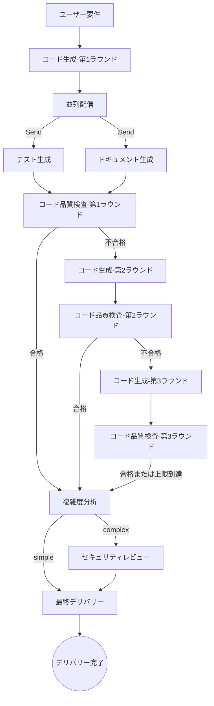
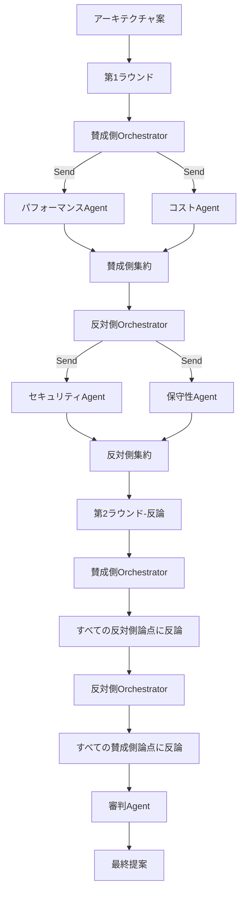

# Multi-Agent AI Tools

> **LangGraph + Groq + Streamlit** ベースのマルチエージェント協調プラットフォーム。8種類のオーケストレーションモード、モダンな紫色テーマUI、リアルタイム実行プロセス表示をサポート。

## ✨ 機能特性

### 🎨 全新UIデザイン
- **モダンな紫色テーマ**：ダークトップナビゲーションバー + 紫色グラデーションボタン + ライトグレー背景
- **カード式サイドバー**：各モード独立カード、アイコン・説明・ステータスラベル付き
- **リアルタイムステータス表示**：実行中に動的更新、折りたたみパネルで各Agent出力を表示
- **モデル情報バッジ**：各Agentの横に実際に使用されているモデルを表示（🧠 llama-3.3-70b-versatile）
- **多言語サポート**：中国語/日本語/英語の3言語切り替え

### 🤖 8種類のオーケストレーションモード

1. **順次パイプライン**：Supervisorが統一調整、4つのサブAgentが順次処理
2. **条件分岐**：入力タイプに応じて対応するAgentグループを動的に起動
3. **ループフィードバック**：コーディング→品質検査→やり直しループ（最大3ラウンド）
4. **並列実行**：3つのAgentが並列レビュー、最後に統合レポート
5. **ディベートモード**：賛成側vs反対側の多ラウンド対戦、審判が最終判定
6. **ネストAgent**：メインAgentが動的計画、必要に応じてサブAgentを召喚
7. **ハイブリッドモードA**：並列生成→ループ品質検査→条件分岐、全自動デリバリーチェーン
8. **ハイブリッドモードB**：ディベート+ネスト混合、サブAgentデータに基づくディベート

### 🔧 コア機能
- **モデル自動降格**：6つのモデルを順次試行、失敗時に自動切り替え
- **インテリジェント計画**：ネストAgentがキーワード認識をサポート（「コードのみ」→テスト・ドキュメントをスキップ）
- **リアルタイムレンダリング**：実行プロセス中に段階的に結果を表示、「フリーズ」なし
- **複雑度判定**：データベース/ネットワーク/暗号化操作を自動識別、セキュリティレビューをトリガー

## 🏗️ アーキテクチャ

### ハイブリッドモードA（3段階パイプライン）



**特徴**：
- 第1ラウンド：コード生成 → 並列でテスト+ドキュメント生成 → コード品質検査
- 第2-3ラウンド：コード生成 → コード品質検査（並列をスキップ）
- 複雑度判定：データベース/ネットワーク/暗号化などのキーワードを識別 → セキュリティレビューをトリガー
- 最終デリバリー：すべての結果 + 品質検査ステータス + 複雑度 + セキュリティレポートを統合

### ハイブリッドモードB（ディベート+ネスト）



**特徴**：
- 各側がまず専門サブAgentを召喚してデータを収集
- UIがサブAgentステータスをリアルタイム表示（⚡パフォーマンス✅ 💰コスト✅）
- 第2ラウンドで相手側のすべての履歴論点を自動取得し、的を絞った反論を実施

## 🛠️ 技術スタック

| コンポーネント | 技術 |
|------|------|
| Agentオーケストレーション | LangGraph (StateGraph) |
| 推論モデル | Groq（6モデル自動降格） |
| インターフェース | Streamlit（紫色テーマ） |
| Prompt管理 | モジュール化Pythonテンプレート |

## 📦 モデル降格リスト

優先度の高い順に試行：

```
openai/gpt-oss-120b
→ openai/gpt-oss-20b
→ qwen/qwen3-32b
→ meta-llama/llama-4-scout-17b-16e-instruct
→ llama-3.3-70b-versatile
→ llama-3.1-8b-instant
```

## 📁 プロジェクト構造

```
multi-agent/
├── app.py                    # Streamlitエントリーポイント（モード切り替え+UI）
├── config.py                 # 共有設定
├── llm.py                    # モデル降格呼び出し層
├── supervisor_pipeline/      # 順次パイプライン
├── conditional_branch/       # 条件分岐
├── loop_feedback/            # ループフィードバック
├── parallel/                 # 並列実行
├── debate/                   # ディベートモード
├── nested_agent/             # ネストAgent
├── hybrid_a/                 # ハイブリッドモードA
│   ├── agents/
│   │   ├── complexity.py     # 複雑度判定
│   │   └── finalizer.py      # 最終デリバリー
│   └── prompts.py
├── hybrid_b/                 # ハイブリッドモードB
│   ├── agents/
│   │   ├── pro_orchestrator.py
│   │   ├── con_orchestrator.py
│   │   ├── performance.py
│   │   ├── cost.py
│   │   ├── security.py
│   │   ├── maintainability.py
│   │   ├── pro_summarizer.py
│   │   ├── con_summarizer.py
│   │   └── judge.py
│   └── prompts.py
├── requirements.txt
└── .env.example
```

## 🚀 クイックスタート

### 1. 仮想環境の作成

```bash
# Windows
python -m venv .venv
.venv\Scripts\Activate.ps1

# macOS/Linux
python -m venv .venv
source .venv/bin/activate
```

### 2. 依存関係のインストール

```bash
pip install -r requirements.txt
```

### 3. 環境変数の設定

```bash
cp .env.example .env
# .envを編集し、GROQ_API_KEYを入力
```

`.env`の例：

```
GROQ_API_KEY=your_groq_api_key_here
LLM_TEMPERATURE=0.3
LLM_MAX_TOKENS=4096
```

### 4. アプリケーションの起動

```bash
streamlit run app.py
```

ブラウザで `http://localhost:8501` にアクセス

## 📖 使用方法

1. **モード選択**：サイドバーのカードをクリックしてオーケストレーションモードを切り替え
2. **要件入力**：メインエリアの入力ボックスに要件を記述またはコードを貼り付け
3. **実行開始**：紫色グラデーションボタン「🚀 開始執行」をクリック
4. **結果確認**：折りたたみパネルで各Agent出力を表示、上部にモデル名を表示

### ネストAgent特殊用法

キーワード認識をサポート：
- "只要代码" / "只需要代码" / "仅代码" → テストとドキュメントをスキップ
- "不需要测试" → テストをスキップ
- "不需要文档" → ドキュメントをスキップ

### ハイブリッドモードA複雑度判定

キーワードを自動識別してセキュリティレビューをトリガー：
- データベース：database, db, sql, query, connect, session
- 認証：password, hash, token, jwt, auth, login, encrypt
- ネットワーク：http, request, api, socket, client
- コードが50行を超える

## 🗺️ オーケストレーションモードロードマップ

| モード | 説明 | ステータス |
|------|------|------|
| 🔄 順次パイプライン | 4つのAgentが順次処理 | ✅ リリース済み |
| 🔀 条件分岐 | 条件付き動的ルーティング | ✅ リリース済み |
| 🔁 ループフィードバック | 反復フィードバック収束 | ✅ リリース済み |
| 🔱 並列実行 | 複数Agent並列集約 | ✅ リリース済み |
| ⚔️ ディベートモード | 複数Agent対抗ディベート | ✅ リリース済み |
| 🪆 ネストAgent | ネストサブAgent呼び出し | ✅ リリース済み |
| 🎛️ ハイブリッドモードA | 並列+ループ+条件分岐 | ✅ リリース済み |
| 🎭 ハイブリッドモードB | ディベート+ネスト混合 | ✅ リリース済み |

## 🎨 UI特性

- **紫色テーマ**：#6C63FFメインカラー、モダンデザイン
- **カードレイアウト**：各モード独立カード、ホバーアニメーション
- **リアルタイムフィードバック**：実行プロセス中に段階的に結果を表示
- **モデルバッジ**：各Agentが使用しているモデルを表示
- **多言語**：中国語/日本語/英語切り替え
- **レスポンシブ**：異なる画面サイズに自動適応

## 📝 License

MIT